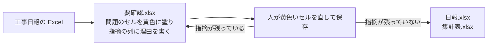

# construction-daily-report

工事日報の Excel から書き忘れや食い違いを見つけて知らせ、人が直したものから、決まった様式の日報と、現場別と月別の集計表を作る試作品です。
ブラウザで開くだけで使え、選んだファイルはそのパソコンのブラウザの中だけで処理し、どこにも送りません。
使っているデータはすべて架空です。

試してみる: https://nemonsoon.github.io/construction-daily-report/

## 解決する手間

現場で書いた日報を、別の様式の日報や集計表へ手で書き写す手間と、その書き写しで起きる間違いを減らします。
書き写す前に、書き忘れや食い違いを Excel の上で知らせるので、集計してから間違いに気付いて直す手間も減ります。

## 使い方の流れ



1. ページで「見本の Excel をダウンロード」を押すと、書き間違いを9か所仕込んだ見本が手に入ります。手元の日報で試すこともできます。
2. 日報の Excel を選ぶと、**要確認.xlsx** が届きます。書き忘れや食い違いのあるセルは黄色く塗られ、右端の「指摘」の列に理由が書かれています。
3. 黄色いセルを Excel で直して保存し、もう一度選びます。指摘が残っていなければ、**日報.xlsx** と **集計表.xlsx** が届きます。

日報.xlsx は、1日と1現場ごとに1枚のシートで、作業員ごとの開始と終了の時刻、休憩、作業時間、人数と合計、作業内容、安全、備考を書きます。
集計表.xlsx は、現場ごと、月ごとの延べ人数と作業時間の合計です。
どちらも A4 縦で横幅が1ページに収まる印刷設定にしてあるので、Excel から PDF に書き出せます。

入力の Excel は、1行に1日と1現場と1作業員の分を書く表の形です。
1行目の見出しに、日付、現場名、天候、作業員名、開始時刻、終了時刻、休憩(分)、作業内容、安全、備考の10列が必要です。
列の順番は問わず、見出しの名前で列を探します。
読むのは先頭のシートだけです。

## 見つける書き忘れや食い違い

空欄と読めない値として、日付、現場名、作業員名、開始時刻、終了時刻の空欄と、時刻を「8時ごろ」のように書いたセルを見つけます。

- 「現場名」が空欄です
- 「開始時刻」の値を読み取れません（例: 8:00）

時刻の矛盾として、終了が開始より前の行、休憩が作業時間より長い行、同じ作業員が同じ日に2つの現場で時間が重なっている行を見つけます。

- 終了時刻が開始時刻と同じか、それより前です
- 同じ日の9行目（山田邸 新築工事）と時間が重なっています

同じ日と同じ現場の食い違いとして、行ごとに天候が違う場合と、同じ作業員の行が2つある場合（同じ行を2回書き写したときなど）を見つけます。

- 同じ日・同じ現場で天候が食い違っています（晴、雨）
- 同じ日・同じ現場に同じ作業員の行が複数あります（2・7行目）

時刻は「8:00」「８：００」「8時30分」のような書き方と、Excel の時刻のセルのどちらでも読みます。

## 画面写真

見本を処理したあとの要確認.xlsx です。


作られた日報.xlsx の1枚です。


## 実際の業務に合わせるとき

- 御社の指定の様式（1日1枚の帳票形式の日報や、決まった形の集計表）に合わせて、読み取りと書き出しを作り替えられます。
- 売上の集計（単価の表との突き合わせ）、現場名の表記ゆれの統一、PDF の出力は、この試作品では外しています。
- 日をまたぐ夜間作業は、この試作品では「終了が開始より前」として指摘します。
- 動かすたびに料金がかかる外部のサービスは使っていません。

## 手元で動かす（開発者向け）

Node.js 24 以上と pnpm を入れた状態で、リポジトリの中で次を実行します。
依存を入れ、コミット前の整形とプッシュ前のテストを行う Git のフックを入れます。

```bash
pnpm install
pnpm exec lefthook install
```

開発用のサーバを起動し、表示された住所をブラウザで開きます。

```bash
pnpm dev
```

テストを実行します。

```bash
pnpm test
```

## ライセンス

MIT
