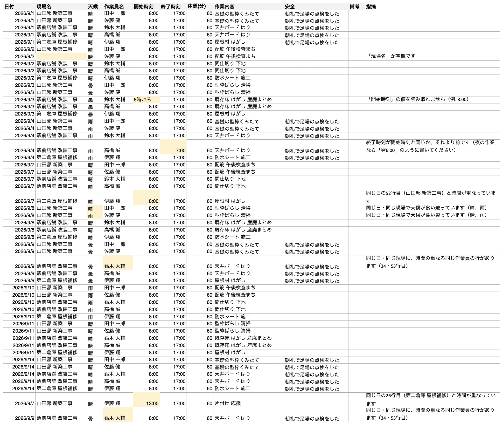
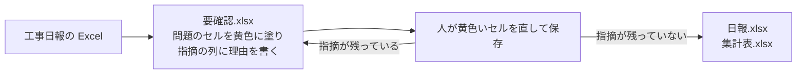
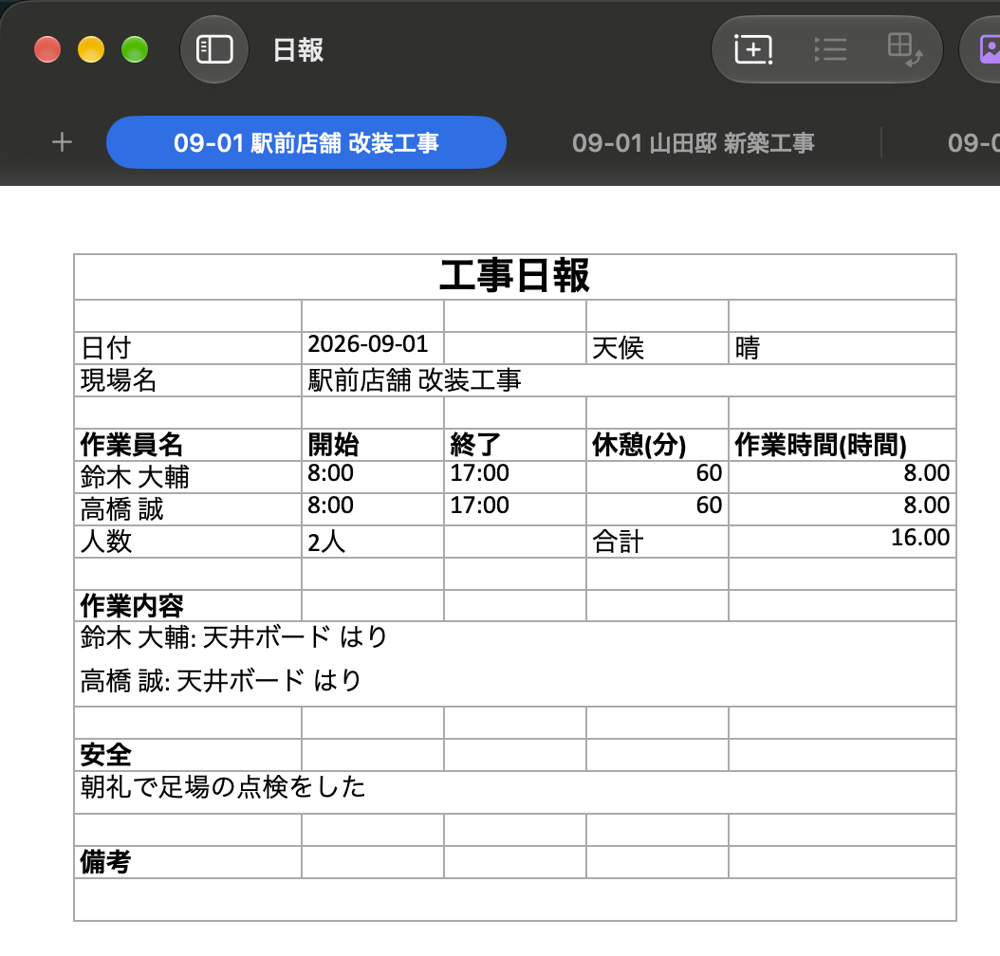
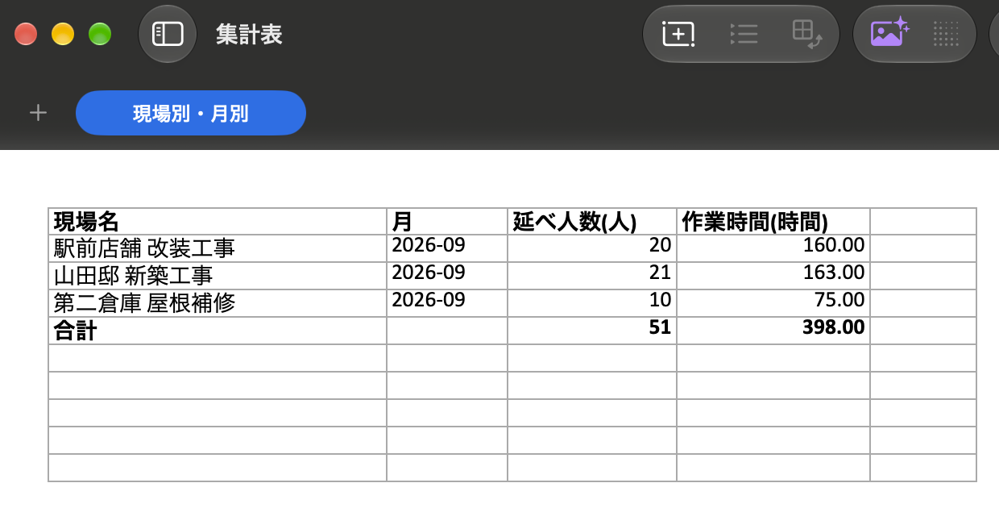

# 日報まとめ

**日報まとめ**は、工事日報の Excel から書き忘れや食い違いを見つけて知らせ、人が直したものから、決まった様式の日報と、月ごとの工数の集計表を作る Web アプリです。
ブラウザで開くだけで使え、選んだファイルはそのパソコンのブラウザの中だけで処理し、どこにも送りません。

試してみる: https://nemonsoon.github.io/construction-daily-report/



## 誰の、どの手間を減らすか

建設会社で、現場で書いた日報を事務所でまとめ直している人の手間を減らします。

- 現場で書いた日報を、決まった様式の日報へ書き写す手間：日報.xlsx を、現場ごとのシートに1日1ページで作ります。
- 現場ごと、月ごとの人数と時間を、集計表へ手で足し上げる手間：集計表.xlsx に、月ごとの現場別の延べ人数と作業員別の出勤日数、それぞれの作業時間の合計を出します。
- 書き忘れや食い違いに、集計したあとで気付いて直す手間：書き写す前に、直してほしいセルを黄色で知らせます。

## 使い方



1. ページで「見本で試す」を押し、「見本をダウンロード」を押すと、書き間違いを9か所仕込んだ見本が手に入ります。見本のファイルは架空のデータです。手元の日報で試すこともできます。
2. 日報の Excel を置くと、**要確認.xlsx** が届きます。書き忘れや食い違いのあるセルは黄色く塗られ、右端の「指摘」の列に理由が書かれています。
3. 黄色いセルを Excel で直して保存し、もう一度置きます。指摘が残っていなければ、**日報.xlsx** と **集計表.xlsx** が届きます。

## 入力の Excel の形

入力の Excel は、1行に1日と1現場と1作業員の分を書く表の形です。
見出しには、日付、現場名、作業員名、開始時刻、終了時刻の5列が必要です。
天候、休憩(分)、作業内容、安全、備考の列は、あれば読み、無ければ空として扱います。
列の順番は問わず、見出しの名前で列を探します。
「作業日」「工事名」「天気」「氏名」「作業者」「始業」「終業」「休憩時間」のような、よく使われる別の言い方の見出しも読みます。
見出しは、すべてのシートの上から10行目までを探すので、上に題名や会社名の行がある Excel や、2枚目のシートに日報がある Excel も読めます。

## 作られるもの

日報.xlsx は、現場ごとに1枚のシートで、日付の順に1日1ページずつ並び、印刷すると1日1枚になります。
各ページには、作成と確認の押印の欄、日付と曜日、天候、作業員ごとの開始と終了の時刻と休憩と作業時間と作業内容、人数と合計、安全、備考を書きます。



集計表.xlsx は、月ごとに1枚のシートで、対象の日報の期間と作成日、現場別の延べ人数と作業時間、作業員別の出勤日数と作業時間を書きます。
合計の行は Excel の数式なので、表の数字を手で直しても合計がそろいます。



どちらも A4 縦で横幅が1ページに収まる印刷設定にしてあるので、Excel から PDF に書き出せます。

## 見つける書き忘れや食い違い

空欄と読めない値として、日付、現場名、作業員名、開始時刻、終了時刻の空欄と、時刻を「8時ごろ」のように書いたセルを見つけます。

- 「現場名」が空欄です
- 「開始時刻」の値を読み取れません（例: 8:00）

時刻の矛盾として、終了が開始より前の行、休憩が作業時間より長い行、同じ作業員が同じ日に2つの現場で時間が重なっている行を見つけます。

- 終了時刻が開始時刻と同じか、それより前です（夜の作業なら「翌6:00」のように書いてください）
- 同じ日の9行目（山田邸 新築工事）と時間が重なっています

同じ日と同じ現場の食い違いとして、行ごとに天候が違う場合と、同じ作業員の行が2つある場合（同じ行を2回書き写したときなど）を見つけます。

- 同じ日・同じ現場で天候が食い違っています（晴、雨）
- 同じ日・同じ現場に同じ作業員の行が複数あります（2・7行目）

日付は「2026/9/1」「2026年9月1日」「令和8年9月1日」「R8.9.1」のような書き方（後ろに「（火）」のような曜日が付いていてもよい）と、Excel の日付のセルのどちらでも読みます。
時刻は「8:00」「８：００」「8時30分」「8:00:00」のような書き方と、Excel の時刻のセルのどちらでも読みます。
日をまたぐ夜の作業は、終了時刻を「翌6:00」か「30:00」のように書くと、翌日の6時に終わったものとして読みます。
書き間違いと見分けるため、翌日だと書いていない行は「終了が開始より前」として指摘します。

## 御社の様式に合わせるとき

- 御社の指定の様式（1日1枚の帳票形式の日報や、決まった形の集計表）に合わせて、読み取りと書き出しを作り替えられます。
- 売上の集計（単価の表との突き合わせ）、現場名の表記ゆれの統一、PDF の出力は、今の日報まとめでは外しています。
- 動かすたびに料金がかかる外部のサービスは使っていません。

## 手元で動かす（開発者向け）

TypeScript、React、Tailwind CSS、shadcn/ui、Vite、exceljs で作っています。

Node.js 24 以上と pnpm を入れた状態で、リポジトリの中で次を実行します。
依存を入れ、コミット前の整形とプッシュ前のテストを行う Git のフックを入れます。

```bash
pnpm install
pnpm exec lefthook install
```

開発用のサーバを起動し、表示された住所をブラウザで開きます。

```bash
pnpm dev
```

テストを実行します。

```bash
pnpm test
```

## ライセンス

MIT
