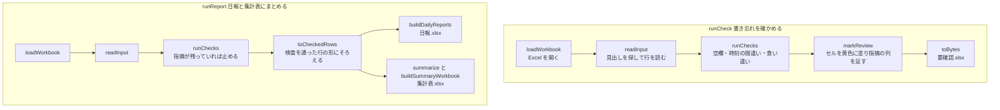

# 作りの説明

日報まとめの作りを、コードを読む前に全体をつかむための文書です。
何ができるか（読める日報の形、作られるもの、見つける書き忘れ）は [使い方の説明書](user-guide.md) に書いてあり、ここでは繰り返しません。
手元で動かす手順は [手元で動かす](development.md) にあります。

## 全体の形

日報まとめは、サーバを持たない1枚の Web ページです。
Excel の読み込み、検査、日報と集計表の作成は、すべて利用者のブラウザの中で行います。
ファイルをどこにも送らないため、ページが通信するのは、ページ自身とその部品（スクリプト、スタイル、書体、画像）を取りに行くときだけです。
書体も Google Fonts などの外部から読まず、ページと一緒に置いています。

公開は GitHub Pages で、`main` に push すると GitHub Actions がテストと build を通したうえで置き換えます（手順は [手元で動かす](development.md#公開の仕組み)）。

## 使っている技術

版の番号は `package.json` が正本なので、ここには書きません。

| 役目 | 使っているもの |
| --- | --- |
| 言語 | TypeScript |
| 画面 | React |
| 見た目 | Tailwind CSS、shadcn/ui（ボタンだけ）、lucide-react（線のアイコン） |
| 書体 | Noto Sans JP（Fontsource でページと一緒に置く） |
| Excel の読み書き | exceljs |
| 組み立てと開発用のサーバ | Vite |
| テスト | Vitest |
| 整形と lint | Biome |
| Git のフック | lefthook |
| 公開 | GitHub Actions と GitHub Pages |

## 処理の流れ

処理が画面に見せるのは、`src/features/daily-report/index.ts` に並べた入口だけです。
中心は次の2つで（`pipeline.ts`）、どちらも Excel のファイルの中身（バイト列）を受け取り、バイト列を返すので、画面やブラウザの仕組みには依存しません。
ほかに、見本の日報を作る `makeSampleFile` と、指摘の型 `Finding`、読めない形を知らせる `InputFormatError` を見せています。

`runReport` も検査をやり直すので、直し残しのある Excel から日報と集計表ができることはありません。
手順2を通らずに手順3から始めても、同じ検査がかかります。

## フォルダの役割

機能ごとにフォルダを分けています（bulletproof-react の features の分け方）。
テストは、確かめる対象のファイルの隣に `*.test.ts` として置きます。

| 場所 | 役割 |
| --- | --- |
| `src/main.tsx` | 入口。書体とスタイルを読み込み、`App` を描く |
| `src/app/` | 画面の組み立て。説明のページとアプリの画面を並べ、住所の末尾で切り替える（`use-screen.ts`） |
| `src/config/` | あちこちで使う定数。出てくるファイルの名前（`files.ts`）、GitHub の説明書などへのリンク（`links.ts`）、説明のページの区画の id（`sections.ts`） |
| `src/components/` | 機能をまたいで使う画面の部品。上部の帯と足元（`layout/`）、ロゴの印、shadcn/ui から取り込んだ部品（`ui/`） |
| `src/lib/` | 機能に依らない道具。ファイルのダウンロード、画面の切り替えの決まり（`screen.ts`）、動きを減らす設定の読み取り、クラス名をまとめる `cn` |
| `src/features/daily-report/` | 処理（画面を持たない）。`excel/`（Excel の読み書きと印刷の書式）、`input/`（見出しの探し方・値の読み方・行の読み込み）、`checks/`（検査。1つの種類を1ファイルにし、`index.ts` がまとめて走らせる）、`outputs/`（要確認.xlsx・日報・集計表と、作業時間・並び順）、`sample/`（見本の日報）、`testing/`（テストだけで使う道具） |
| `src/features/landing/` | 説明のページ。`landing-page.tsx` が区画を並べ、区画ごとの部品は `components/` |
| `src/features/try/` | アプリの画面（見本で試す）。状態の移り変わり（`flow.ts`）、操作をまとめるフック（`hooks/`）、状態と操作を配る context（`try-flow-context.tsx`）、手順ごとの部品（`components/`） |
| `public/` | ブラウザのタブのアイコン |
| `docs/images/` | README・説明書・ページで使う画面写真 |

ファイル名はすべてケバブケースにし、部品の名前（`TryPage` など）はパスカルケースにします。
読み込みは、フォルダをまたぐときは `@/` から書き、同じフォルダの中は `./` で書きます。

## 作りの決まり

- 処理と画面を分ける。処理（`src/features/daily-report/`）は React もブラウザの仕組みも使わず、テストで中身を確かめる。
- 読み込みの向きは、`app` → `features` → `components`・`lib`・`config` の一方向にする。共通の部品や道具は機能を読み込まない。機能どうしは読み込まないが、アプリの画面（`try`）だけは処理（`daily-report`）を `index.ts` の入口から読み込む。処理を呼ぶことがアプリの画面の仕事のため。
- アプリの画面の状態は、状態の移り変わり（`src/features/try/flow.ts`）の1か所に持つ。できあがったファイルもここに入れる。判断はここの純粋関数に集め、テストで押さえる。ブラウザとのやり取り（ファイルを読む、処理を呼ぶ、ダウンロードする）は `hooks/use-try-flow.ts` に置く。
- 手順の部品へは、状態と操作を props で受け渡さず、context（`try-flow-context.tsx`）から各部品が取り出す。context はアプリの画面の中だけに置く。
- 見た目の部品は単体テストをせず、ブラウザの画面写真で確かめる。
- 出てくるファイルの名前・リンク・区画の id のように、2か所以上で使う値は `src/config/` に1つだけ置く。
- 説明のページとアプリの画面は、住所の末尾（`#try`）で切り替える1つのページにする（`src/lib/screen.ts`）。GitHub Pages のどの住所に置いても動くよう、`vite.config.ts` の `base` は `./` にしてある。
- Excel を書き出すときは、必ず `toBytes`（`src/features/daily-report/excel/sheet.ts`）を通す。exceljs は時刻を保存するときに割り算の誤差で 8:00 を 7:59:59.999… にすることがあり、`toBytes` が保存の直前にぴったりの値へ戻している。
- Excel の書式には、曜日の `aaa` や条件つきの書式のような、Excel 以外の表計算ソフトで読めない書き方を使わない。曜日は隣のセルに文字で書き、翌日の時刻はそのセルだけ `"翌"h:mm` の書式にする（`src/features/daily-report/outputs/daily-report.ts`）。
- 現場名と作業員名は、元の日報に最初に出てきた順に並べる（`src/features/daily-report/outputs/checked-row.ts`）。漢字は読み仮名が無いと読みの順に並べられないため。
- 動かすたびに料金がかかる外部のサービスは使わない。
