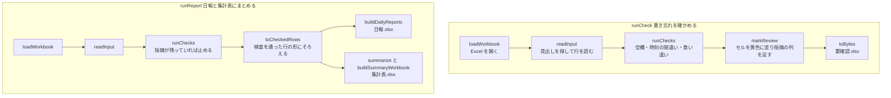

# 作りの説明

日報まとめの作りを、コードを読む前に全体をつかむための文書です。
何ができるか（読める日報の形、作られるもの、見つける書き忘れ）は [README](../README.md) に書いてあり、ここでは繰り返しません。
手元で動かす手順は [手元で動かす](development.md) にあります。

## 全体の形

日報まとめは、サーバを持たない1枚の Web ページです。
Excel の読み込み、検査、日報と集計表の作成は、すべて利用者のブラウザの中で行います。
ファイルをどこにも送らないため、ページが通信するのは、ページ自身とその部品（スクリプト、スタイル、書体、画像）を取りに行くときだけです。
書体も Google Fonts などの外部から読まず、ページと一緒に置いています。

公開は GitHub Pages で、`main` に push すると GitHub Actions がテストと build を通したうえで置き換えます（手順は [手元で動かす](development.md#公開の仕組み)）。

## 使っている技術

版の番号は `package.json` が正本なので、ここには書きません。

| 役目 | 使っているもの |
| --- | --- |
| 言語 | TypeScript |
| 画面 | React |
| 見た目 | Tailwind CSS、shadcn/ui（ボタンだけ）、lucide-react（線のアイコン） |
| 書体 | Noto Sans JP（Fontsource でページと一緒に置く） |
| Excel の読み書き | exceljs |
| 組み立てと開発用のサーバ | Vite |
| テスト | Vitest |
| 整形と lint | Biome |
| Git のフック | lefthook |
| 公開 | GitHub Actions と GitHub Pages |

## 処理の流れ

処理は2つの入口だけを画面に見せます（`src/pipeline.ts`）。
どちらも Excel のファイルの中身（バイト列）を受け取り、バイト列を返すので、画面やブラウザの仕組みには依存しません。

`runReport` も検査をやり直すので、直し残しのある Excel から日報と集計表ができることはありません。
手順2を通らずに手順3から始めても、同じ検査がかかります。

## フォルダの役割

| 場所 | 役割 |
| --- | --- |
| `src/*.ts` | 処理。画面に見せる2つの入口（`pipeline.ts`）、Excel の読み書き（`sheet.ts`）、見出しの探し方（`table.ts`、`columns.ts`）、値の読み方（`parse.ts`）、行の読み込み（`read-input.ts`）、検査を通った行と並び順（`checked-row.ts`）、指摘の形（`finding.ts`）、作業時間（`work-time.ts`）、要確認.xlsx（`review.ts`）、日報（`daily-report.ts`）、集計表（`summary.ts`）、印刷の書式（`form.ts`）、見本（`sample-data.ts`） |
| `src/checks/` | 検査。1つの種類を1ファイルにし、`index.ts` がまとめて走らせる |
| `src/app/` | 画面。説明のページとアプリの画面の部品と、画面の状態の移り変わり（`flow.ts`） |
| `src/components/ui/` | shadcn/ui から取り込んだ部品 |
| `test/` | テスト。`src/` と同じ並びに置く |
| `public/` | ブラウザのタブのアイコン |
| `docs/images/` | README とページで使う Excel の画面写真 |

## 作りの決まり

- 処理と画面を分ける。処理（`src/*.ts` と `src/checks/`）は React もブラウザの仕組みも使わず、テストで中身を確かめる。
- 画面の中で判断を持つのは、画面の状態の移り変わり（`src/app/flow.ts`）だけにし、ここをテストで押さえる。見た目の部品は単体テストをせず、ブラウザの画面写真で確かめる。
- 説明のページとアプリの画面は、住所の末尾（`#try`）で切り替える1つのページにする（`src/app/screen.ts`）。GitHub Pages のどの住所に置いても動くよう、`vite.config.ts` の `base` は `./` にしてある。
- Excel を書き出すときは、必ず `toBytes`（`src/sheet.ts`）を通す。exceljs は時刻を保存するときに割り算の誤差で 8:00 を 7:59:59.999… にすることがあり、`toBytes` が保存の直前にぴったりの値へ戻している。
- Excel の書式には、曜日の `aaa` や条件つきの書式のような、Excel 以外の表計算ソフトで読めない書き方を使わない。曜日は隣のセルに文字で書き、翌日の時刻はそのセルだけ `"翌"h:mm` の書式にする（`src/daily-report.ts`）。
- 現場名と作業員名は、元の日報に最初に出てきた順に並べる（`src/checked-row.ts`）。漢字は読み仮名が無いと読みの順に並べられないため。
- 動かすたびに料金がかかる外部のサービスは使わない。
